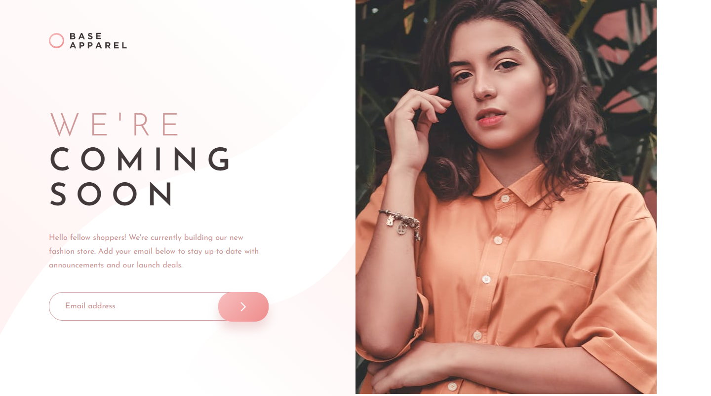
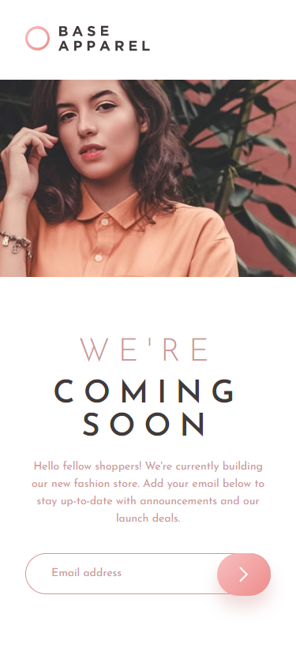
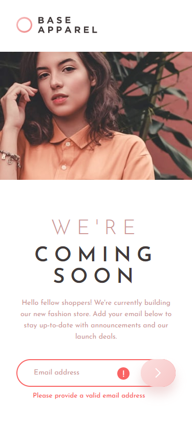

# Frontend Mentor - Base Apparel coming soon page solution

This is a solution to the [Base Apparel coming soon page challenge on Frontend Mentor](https://www.frontendmentor.io/challenges/base-apparel-coming-soon-page-5d46b47f8db8a7063f9331a0). Frontend Mentor challenges help you improve your coding skills by building realistic projects.

## Table of contents

- [Overview](#overview)
  - [The challenge](#the-challenge)
  - [Screenshot](#screenshot)
  - [Links](#links)
- [My process](#my-process)
  - [Built with](#built-with)
  - [What I learned](#what-i-learned)
- [Author](#author)

## Overview

### The challenge

Users should be able to:

- View the optimal layout for the site depending on their device's screen size
- See hover states for all interactive elements on the page
- Receive an error message when the `form` is submitted if:
  - The `input` field is empty
  - The email address is not formatted correctly

### Screenshot

### Links

- Solution URL: (https://www.frontendmentor.io/solutions/responsive-coming-soon-page-6V7aJGGui)
- Live Site URL: (https://lm-ba-coming-soon-page.netlify.app/)

## My process

### Built with

- Semantic HTML5 markup
- CSS custom properties/vars
- Desktop-first workflow

### What I learned

I learnt how to code a layout from a design where their was this illusion of a max-width container, but I couldn't do it that way. Since the left section with the navbar and text had a background stretch to the left, but not past the image on the right, I couldn't use a max width container and just did some playing around with the CSS and got it to work!

## Author

- Website - [Leon Michalak](https://www.leonmichalak.tech)
- Frontend Mentor - [@NinjaInShade](https://www.frontendmentor.io/profile/NinjaInShade)
- Instagram - [@lmdeveloper](https://www.instagram.com/lmdeveloper/)
